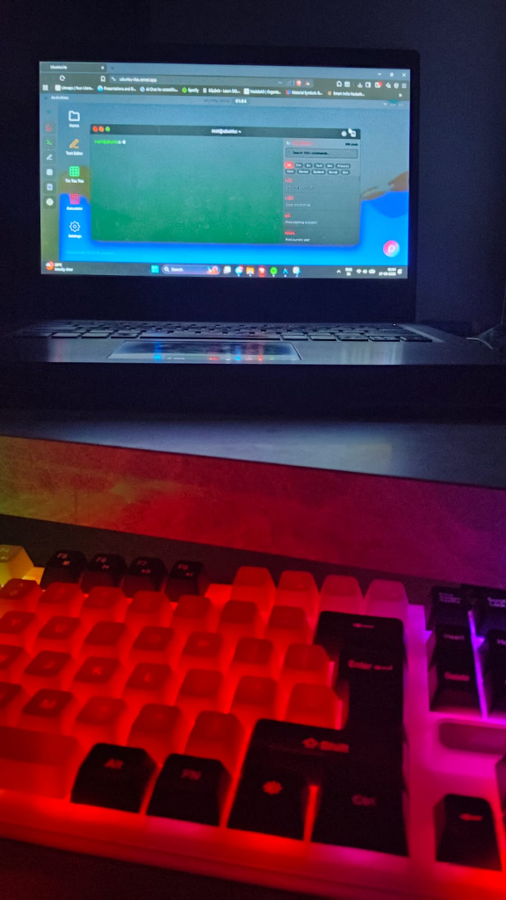
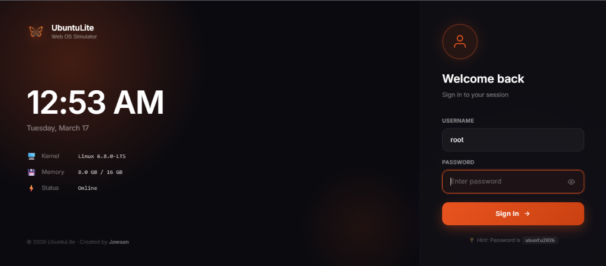
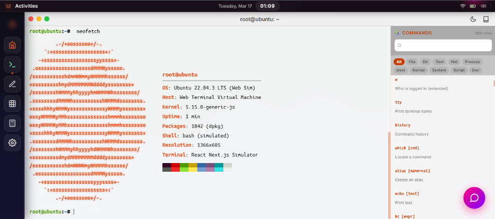

# UbuntuLite 2026



A sleek, simulated web terminal and desktop environment built with Next.js, React, and TypeScript. UbuntuLite brings a robust, interactive Linux-like interface directly into your browser, allowing for realistic mock terminal operations, file management, and immersive desktop applications. Designed with performance and aesthetics in mind.

---

## 📸 Screenshots

| Login Screen | Terminal Day Mode |
| :---: | :---: |
|  |  |

---

## 🚀 Features

*   **Draggable Window System:** Immersive, multi-window environment with draggable headers. Experience simulated context menus, multi-tasking, minimizing/maximizing, and z-index ordering.
*   **Fully Functional Terminal Emulator:** Support for 20+ realistic mock commands such as `ls`, `cd`, `cat`, `mkdir`, `top`, `ping`, and even `apt` installation mockups, complete with functional visual outputs.
*   **Advanced UI Refinement:**
    *   🌗 **Day/Dark Mode:** Intelligent theme-switching with optimized text contrast for both light and dark backgrounds.
    *   📐 **Responsive Modals:** Modals like "Properties" and "Save File" dynamically adapt to window sizes, preventing layout cuts.
    *   🖱️ **Smart Context Menus:** In-folder context menus intelligently flip or shift to ensure they remain visible at window edges.
*   **Interactive Desktop Apps:**
    *   📁 **Folder Explorer:** Real-time mock file system navigation with a context menu to copy, paste, rename, and delete virtual files.
    *   📝 **Text Editor:** Create and edit files within the virtual file system with built-in "Save As" functionality.
    *   ⚙️ **Settings App:** Dynamically change desktop backgrounds, terminal user profiles, and color themes.
    *   🎮 **Tic-Tac-Toe Neon:** Computer VS User gameplay with a glowing UI.
    *   🧮 **Calculator:** A fully functional desktop calculator.
*   **Persistent Virtual File System:** Built using `localStorage` to keep your created files and directories intact between page reloads, providing a persistent and stateful experience.
*   **Aesthetic Design:** Complete with professional typography, glassmorphism effects, smooth animations, and a modern Ubuntu-inspired aesthetic.

## 🛠️ Built With

*   **Framework:** [Next.js](https://nextjs.org/) (App Router)
*   **Library:** React
*   **Language:** TypeScript
*   **Styling:** Custom Vanilla CSS & Glassmorphism

## 📦 Getting Started

### Prerequisites

Ensure you have **Node.js** installed globally on your machine. 

### Installation

1. Clone the repository:
   ```bash
   git clone <repository_url>
   cd college_offline_test
   ```

2. Install the necessary dependencies:
   ```bash
   npm install
   ```

3. Run the development server:
   ```bash
   npm run dev
   ```

4. Open your browser and navigate to `http://localhost:3000`

## 💼 Copyright

&copy; **2026 UbuntuLite**
Developed and maintained by **Jawaan**.

*All simulated file systems, mock apps, and tools are purely visual and client-side logic for demonstration and practice purposes. None of the included apps modify the real host system files.*
